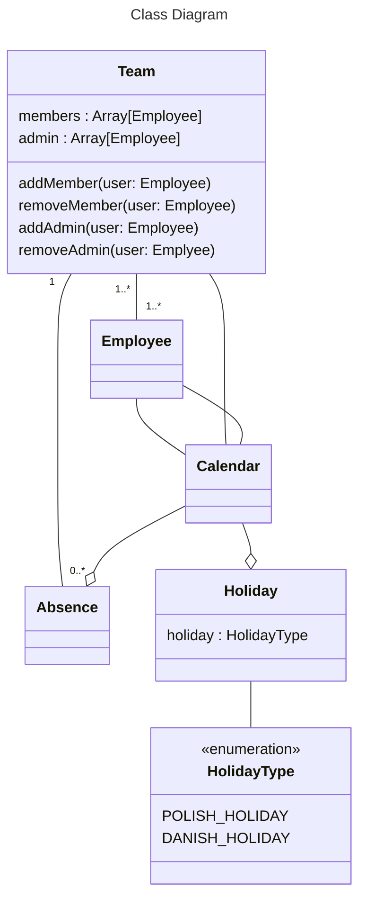

```mermaid
---
title: Class Diagram
---
classDiagram
    direction TB

    Team "1..*" -- "1..*" Employee

    Team "1" -- "0..*" Absence


    Employee -- Calendar

    Team -- Calendar
    Employee -- Calendar

    Calendar --o Holiday

    Calendar --o Absence

    Holiday -- HolidayType


    class HolidayType {
        <<enumeration>>
        POLISH_HOLIDAY
        DANISH_HOLIDAY
    }


    class Team {
        members : Array[Employee]
        admin : Array[Employee]

        addMember(user: Employee)
        removeMember(user: Employee)
        addAdmin(user: Employee)
        removeAdmin(user: Emplyee)
    }

    class Employee {

    }

    class Absence {

    }

    class Holiday {
        holiday : HolidayType

    }

    class Calendar {

    }


```
