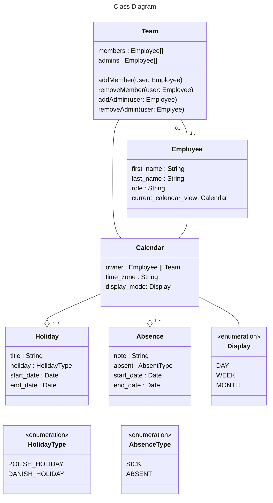

```mermaid
---
title: Class Diagram
---
classDiagram
    direction TB

    Team "0..*" -- "1..*" Employee


    Team -- Calendar
    Employee -- Calendar

    Calendar --o "1..*" Holiday

    Calendar --o "1..*" Absence

    Holiday -- HolidayType

    Absence -- AbsenceType

    Calendar -- Display


    class HolidayType:::styleClass {
        <<enumeration>>
        POLISH_HOLIDAY
        DANISH_HOLIDAY
    }

    class AbsenceType {
        <<enumeration>>
        SICK
        ABSENT
    }

    class Display {
        <<enumeration>>
        DAY
        WEEK
        MONTH
    }


    class Team {
        members : Employee[]
        admins : Employee[]

        addMember(user: Employee)
        removeMember(user: Employee)
        addAdmin(user: Employee)
        removeAdmin(user: Emplyee)
    }

    class Employee {
        first_name : String
        last_name : String
        role : String
        current_calendar_view: Calendar

    }

    class Absence {
        note : String
        absent : AbsentType
        start_date : Date
        end_date : Date

    }

    class Holiday {
        title : String
        holiday : HolidayType
        start_date : Date
        end_date : Date
    }

    class Calendar {
        owner : Employee || Team
        time_zone : String
        display_mode: Display


    }


```

