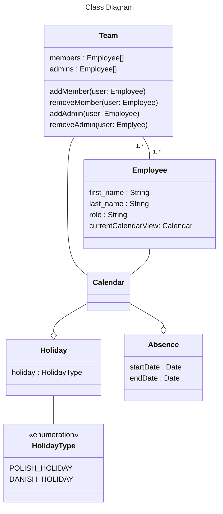

```mermaid
---
title: Class Diagram
---
classDiagram
    direction TB

    Team "1..*" -- "1..*" Employee


    Team -- Calendar
    Employee -- Calendar

    Calendar --o Holiday

    Calendar --o Absence

    Holiday -- HolidayType


    class HolidayType {
        <<enumeration>>
        POLISH_HOLIDAY
        DANISH_HOLIDAY
    }


    class Team {
        members : Employee[]
        admins : Employee[]

        addMember(user: Employee)
        removeMember(user: Employee)
        addAdmin(user: Employee)
        removeAdmin(user: Emplyee)
    }

    class Employee {
        first_name : String
        last_name : String
        role : String
        currentCalendarView: Calendar

    }

    class Absence {
        startDate : Date
        endDate : Date

    }

    class Holiday {
        holiday : HolidayType

    }

    class Calendar {

    }


```
