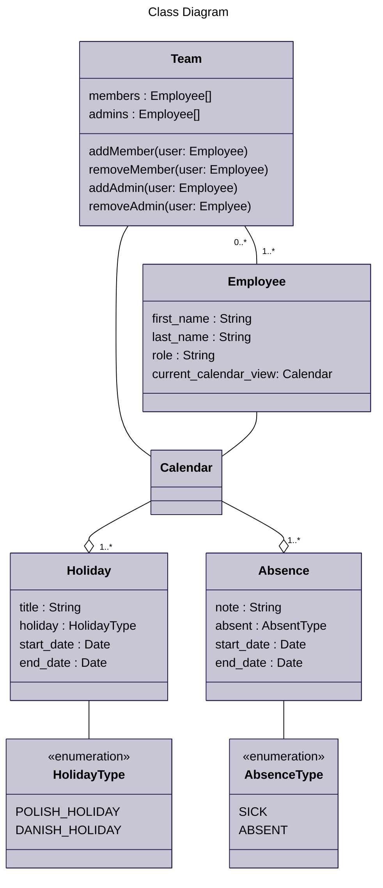

```mermaid
---
title: Class Diagram
---
%%{
    init: {
        'theme': 'base',
        'themeVariables': {
            'darkMode': 'false',
            'background': '#fff',
            'primaryColor': '#C8C6D4',
            'primaryTextColor': '#000',
            'primaryBorderColor': '#211A51',
            'lineColor': '#000',
            'secondaryColor': '#006100',
            'tertiaryColor': '#fff'
        }
    }
}%%
classDiagram
    direction TB

    Team "0..*" -- "1..*" Employee


    Team -- Calendar
    Employee -- Calendar

    Calendar --o "1..*" Holiday

    Calendar --o "1..*" Absence

    Holiday -- HolidayType

    Absence -- AbsenceType


    class HolidayType {
        <<enumeration>>
        POLISH_HOLIDAY
        DANISH_HOLIDAY
    }

    class AbsenceType {
        <<enumeration>>
        SICK
        ABSENT
    }


    class Team {
        members : Employee[]
        admins : Employee[]

        addMember(user: Employee)
        removeMember(user: Employee)
        addAdmin(user: Employee)
        removeAdmin(user: Emplyee)
    }

    class Employee {
        first_name : String
        last_name : String
        role : String
        current_calendar_view: Calendar

    }

    class Absence {
        note : String
        absent : AbsentType
        start_date : Date
        end_date : Date

    }

    class Holiday {
        title : String
        holiday : HolidayType
        start_date : Date
        end_date : Date
    }

    class Calendar {


    }


```
